## 苍穹外卖 笔记

## p2

黑马大学：**大同互联网职业技术学院**

## p3

项目概述、环境搭建

软件开发流程

- 需求分析（产品经理）
- 设计（UI设计师、架构师）
- **编码（开发工程师）**
- 测试（测试工程师）
- 上线运维（运维工程师）

软件环境

- 开发环境 development
- 测试环境 testing
- 生产环境 production：对外提供服务

## p4

项目介绍：管理端、用户端

产品原型：html（资料）

技术选型  

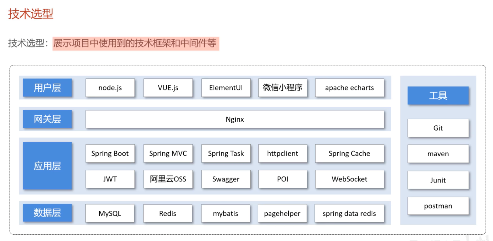

## p5 前端环境搭建

前端环境搭建

- 管理端的Web页面
- 用户端的小程序

后端环境搭建

- 后端服务Java

前端工程基于Nginx运行

Nginx必须放在没有中文的目录才能运行

`E:\develop\GithubRepo\CangQiongWaiMai-Java\nginx-1.20.2` 运行 `nginx.exe`

## p6 后端环境搭建（适合反复观看）

后端工程基于maven，分模块开发

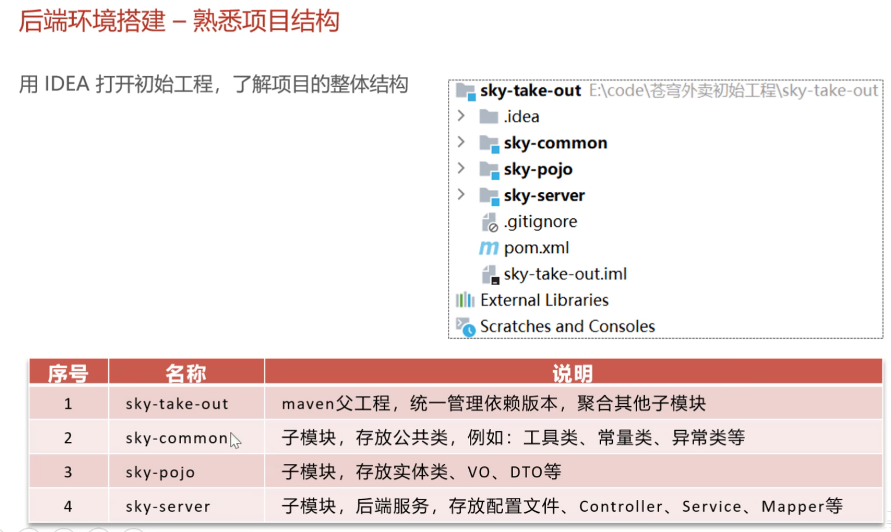

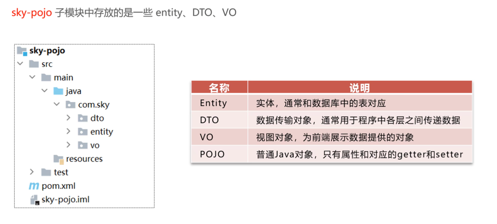

## p7 Git环境搭建

- 感恩www.exception.site让我轻松激活IDEA
- 感恩Git和IDEA的联动让我push得这么愉快

## p8 数据库环境搭建

`百度网盘/#HFUT/#学习资料/黑马JavaWeb/day02_MySQL基础`

到这一步推不下去，一直勾不上

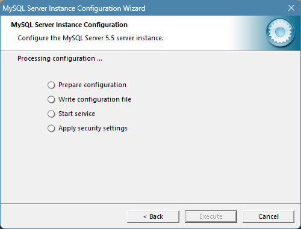

应该是MySQL5.5的问题，去官网下载了MySQL82，解决

ps：GeekUninstaller真好用，还会帮忙删除残留数据和注册表，Win自带的卸载就不能

到这一步，实现了MySQL82的启动

[sqlyog报错码2058](https://www.jb51.net/database/308515yax.htm)

[下载新版本sqlyog](http://www.winwin7.com/soft/32507.html)

安装包放在`百度网盘/软件资源`

通过sql文件导入数据库

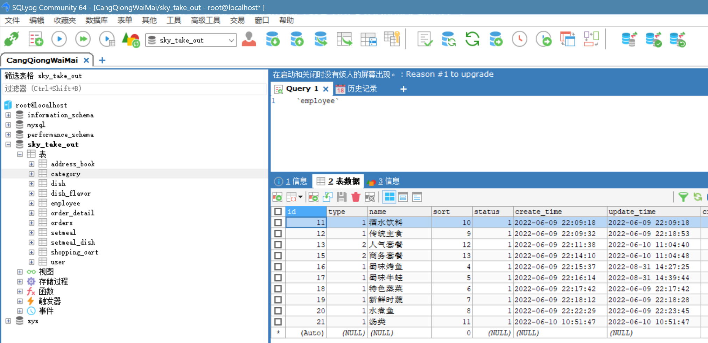

## p9 前后端联调

### 编译Compile

- 报错：`Error running 'sky-take-out [compile]': Project JDK is not specified.` 

- 手动配置了jdk1.8

  - File/Settings  搜索maven  配置`Maven/Importing-JDK for importer`

    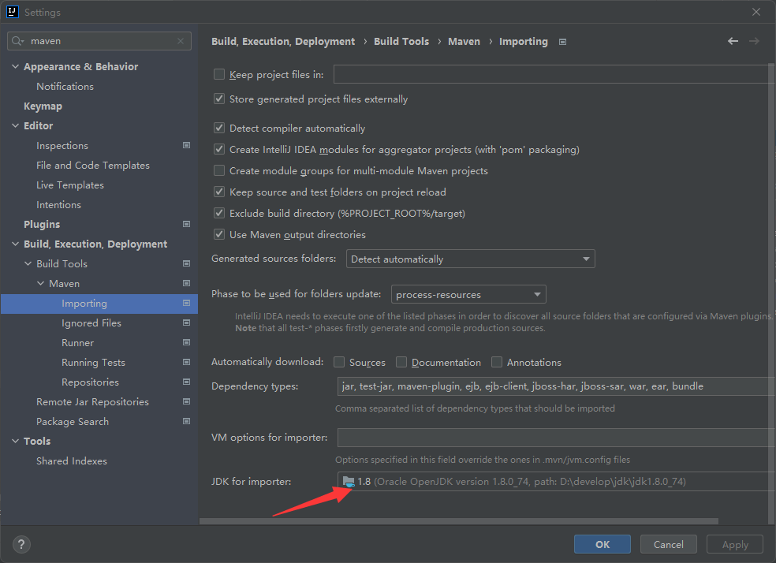

  - File/Settings  搜索jdk  配置`Compiler/JavaCompiler-Project bytecode version`

    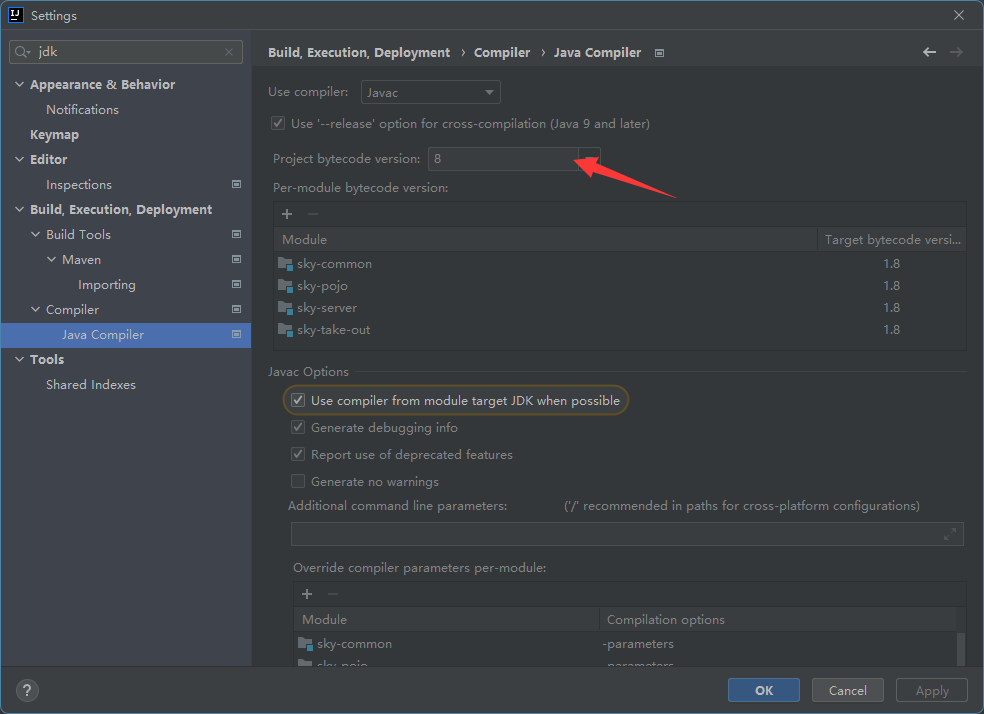

- 第一次编译Downloading了很多东西

  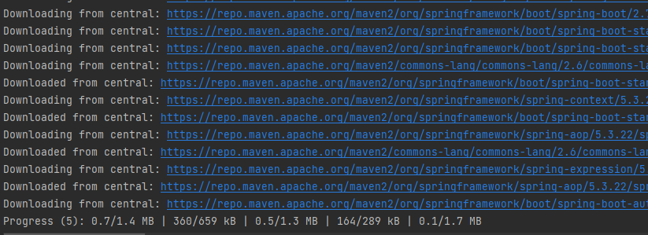

### Build Success

感动！

### 记得check以下注意事项

1. 前端nginx.exe打开
2. MySQL运行
3. `sky-server/main/resources/application-dev.yml`的数据库username和password与自己的一致

### 代码讲解

**断点调试**

1. 单步执行
2. 放行（直到下一个断点）

**`EmployeeController`调用`EmployeeServiceImpl`**

**查询数据库中有没有用户信息**

**捕获父类异常BaseException**

**jwtProperties**

**EmployeeLoginVO**通过builder()来构建对象

### 运行报错

想要运行`SkyApplication.java`来实现登录功能，但不知道怎么配置运行，按默认的maven来，执行结果如下：

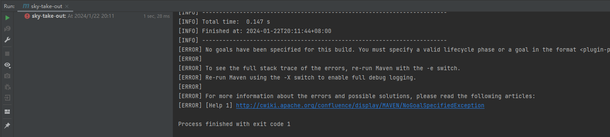

究其原因是sky-server的pom.xml的一些plugin没有更成功导入，这个问题体现在maven窗口中，如下：

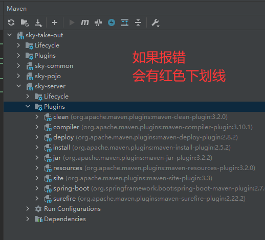

参考资料：

[IDEA运行SpringBoot 知乎教程](https://zhuanlan.zhihu.com/p/621592846)

[胡景峰曾经写的文档](http://t.csdnimg.cn/YXDjR)

[解决`<artifactId>spring-boot-maven-plugin</artifactId>`爆红问题](https://blog.csdn.net/YLXCA/article/details/128634414)

我的做法：

- Maven窗口sky-server/Lifecycle/clean

- 点击Reload

  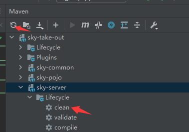

- 只剩下`<artifactId>spring-boot-maven-plugin</artifactId>`爆红时

  在下面指定版本`<version>2.7.6</version>`再刷新试试即可

- 当没有爆红时候，回头看java会多一些小icon给你点

  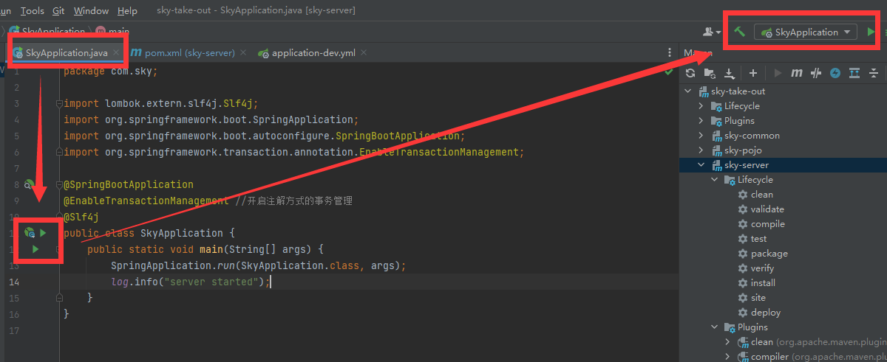

### 成功运行

bug的消除就像炼丹一样玄学，我都不知道我执行了什么操作，原来的爆红就在我的代码间消失不见

## p10 前后端联调 Nginx反向代理和负载均衡
